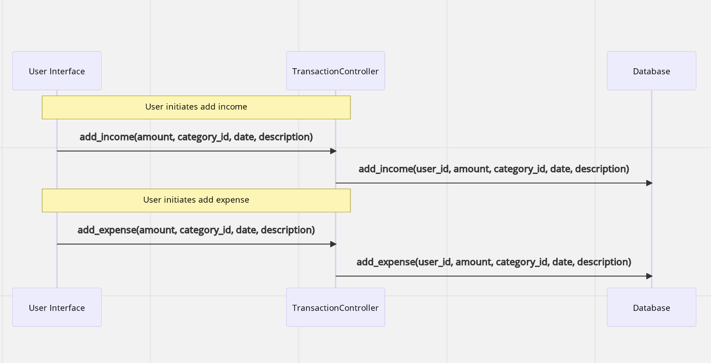
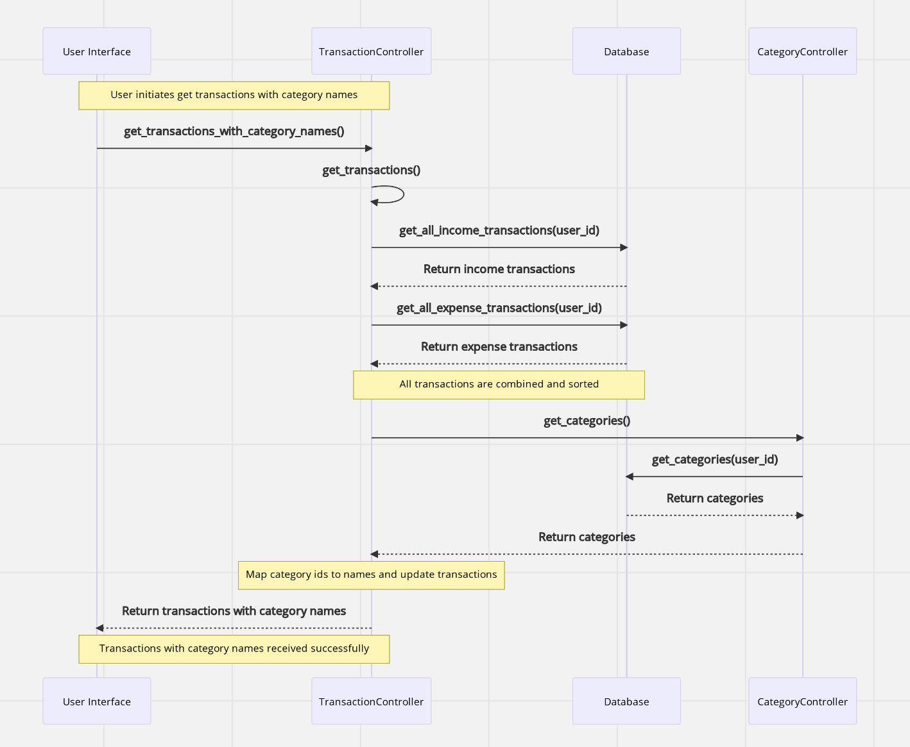
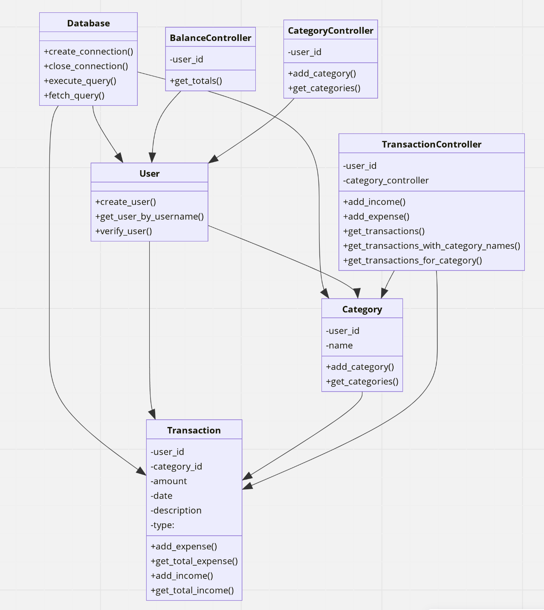

## Architectural Description

The architecture of the system is designed around a three-tiered layered structure, following the principles of separation of concerns and modularity. 

### Models

This directory contains the core application logic of the application. The files in this directory implement functionality related to user authentication, balance calculation, transactions, and categories.

- The user_logic.py module handles user registration and login.

- The balance.py module provides a function to calculate the user's balance.

- The balance_controller.py, transaction_controller.py, and category_controller.py modules define classes responsible for coordinating specific operations and interactions between the user interface, the underlying application logic, and the database.

### User Interface

This directory contains the user interface code implemented using the tkinter library. It has separate views for registration, login, and the home screen, along with a UI manager and a transaction view.

- The registerview.py, loginview.py, homeview.py, and transactionview.py modules define the views for user registration, login, home screen, and transaction management. 

- The ui_manager.py module is responsible for managing the overall UI structure and navigation,

### Database

This directory contains the code to interact with the SQLite database. It defines the schema, creates the database and tables, and provides query execution and table management functionality.

- The create_database.py module contains code to create the database and its tables based on the defined schema.

- The user.py, income.py, expense.py, and categories.py modules provide functionality for managing the respective database tables. 

- The database.py module provides functions for connecting to the SQLite database, executing queries, and fetching results. It bridges the application logic and the database, ensuring that the data is correctly stored and retrieved.

## Sequence diagrams

### This sequence diagram represents the flow of adding income and expense transactions. 

### This sequence diagram represents the flow of getting transactions with category names.

### Class Diagram

